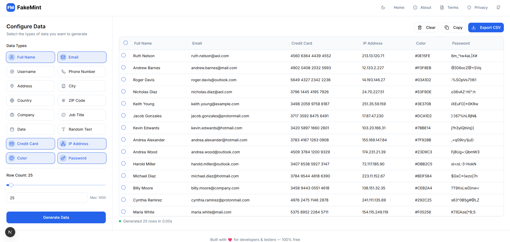

# FakeMint - Fake Data Generator

A powerful, user-friendly web application for generating realistic fake data for development, testing, and demonstration purposes.



## Features

- **Customizable Data Fields**: Choose from a variety of data types including:
  - Personal information (names, emails, usernames, phone numbers)
  - Addresses (street, city, country, ZIP code)
  - Professional details (company names, job titles)
  - Dates and times
  - Random text
  - Credit card numbers (for testing, not real)
  - IP addresses
  - Colors
  - Secure passwords

- **Flexible Configuration**:
  - Select which fields to include
  - Specify the number of rows to generate
  - Sort data by any column
  - Select specific rows for export

- **Instant Generation**:
  - Generate thousands of rows in seconds
  - Performance metrics show generation time

- **Export Options**:
  - Copy to clipboard (TSV format)
  - Export to CSV file
  - Copy individual cell values with a single click

- **Modern UI**:
  - Clean, responsive design
  - Dark/light mode support
  - Sortable columns
  - Loading states
  - Tooltips for better usability

## Getting Started

### Prerequisites

- Node.js 18.0.0 or higher
- npm or pnpm package manager

### Installation

1. Clone the repository:
   ```bash
   git clone https://github.com/0x98c9/fakemint.git
   cd fakemint
   ```

2. Install dependencies:
   ```bash
   npm install
   # or
   pnpm install
   ```

3. Start the development server:
   ```bash
   npm run dev
   # or
   pnpm dev
   ```

4. Open [http://localhost:3000](http://localhost:3000) in your browser to see the application.

## Usage

1. **Configure Data Fields**:
   - Select the data types you want to generate from the configuration panel
   - Adjust the number of rows to generate

2. **Generate Data**:
   - Click the "Generate Data" button to create your dataset
   - View the generated data in the table

3. **Manage Data**:
   - Sort columns by clicking on column headers
   - Select specific rows using checkboxes
   - Clear all data with the "Clear" button

4. **Export Data**:
   - Copy all data (or selected rows) to clipboard
   - Export to CSV file
   - Click on individual cells to copy their values

## Technology Stack

- **Framework**: [Next.js](https://nextjs.org/)
- **UI Components**: Custom components with [Radix UI](https://www.radix-ui.com/)
- **Styling**: [Tailwind CSS](https://tailwindcss.com/)
- **Icons**: [Lucide React](https://lucide.dev/)
- **State Management**: React Hooks

## Project Structure

```
fake-data-generator/
├── app/                  # Next.js app directory
├── components/           # React components
│   ├── ui/               # UI components
│   └── ...               # Feature components
├── hooks/                # Custom React hooks
├── lib/                  # Utility functions and types
│   ├── generate-fake-data.ts  # Core data generation logic
│   ├── types.ts          # TypeScript type definitions
│   └── utils.ts          # Helper utilities
├── public/               # Static assets
└── styles/               # Global styles
```

## Customization

### Adding New Data Types

To add new data types, modify the following files:

1. Update `lib/generate-fake-data.ts` with your new data generation function
2. Add the new field to the `selectedFields` array in `components/fake-data-generator.tsx`

### Styling

The application uses Tailwind CSS for styling. Customize the look and feel by modifying:

- `tailwind.config.ts` for theme configuration
- `styles/globals.css` for global styles

## Contributing

Contributions are welcome! Please feel free to submit a Pull Request.

1. Fork the repository
2. Create your feature branch (`git checkout -b feature/amazing-feature`)
3. Commit your changes (`git commit -m 'Add some amazing feature'`)
4. Push to the branch (`git push origin feature/amazing-feature`)
5. Open a Pull Request

## License

This project is licensed under the MIT License - see the LICENSE file for details.

## Acknowledgments

- [Faker.js](https://fakerjs.dev/) for inspiration on fake data generation
- [shadcn/ui](https://ui.shadcn.com/) for UI component inspiration